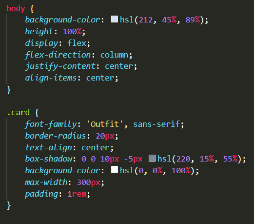

# Frontend Mentor - QR code component solution

This is a solution to the [QR code component challenge on Frontend Mentor](https://www.frontendmentor.io/challenges/qr-code-component-iux_sIO_H). Frontend Mentor challenges help you improve your coding skills by building realistic projects. 

## Table of contents

- [Overview](#overview)
  - [Screenshot](#screenshot)
  - [Links](#links)
- [My process](#my-process)
  - [Built with](#built-with)
  - [What I learned](#what-i-learned)
  - [Continued development](#continued-development)
  - [Useful resources](#useful-resources)
- [Author](#author)

**Note: Delete this note and update the table of contents based on what sections you keep.**

## Overview

### Screenshot

### Links

- Solution URL: [Add solution URL here](https://github.com/jeeheezy/FEM-QR-code-component)
- Live Site URL: [https://jeeheezy.github.io/FEM-QR-code-component/](https://jeeheezy.github.io/FEM-QR-code-component/)

## My process

### Built with

- Semantic HTML5 markup
- CSS custom properties
- Flexbox
- Mobile-first workflow

### What I learned

I learned how to center items using CSS Flexbox.

It was also a nice refresher on distinguishing padding and margins and how they impact the different ways elements interact.

### Continued development

I'd like to get more used to writing CSS in general, as the concepts are familiar but putting them to use resulted in spacing and sizing issues that I did not forsee. Flexbox does seem very powerful but the use case for this was relatively simple, so I'm interested in testing it out on more complex layouts.

### Useful resources

- [W3Schools](https://www.w3schools.com/css/default.asp) - My go-to when looking for a starting point for structure and basic how-to's on CSS.

## Author

- LinkedIn - [Jeeho Lee](https://www.linkedin.com/in/jeeho-lee-719852182/)
- Frontend Mentor - [@jeeheezy](https://www.frontendmentor.io/profile/jeeheezy)